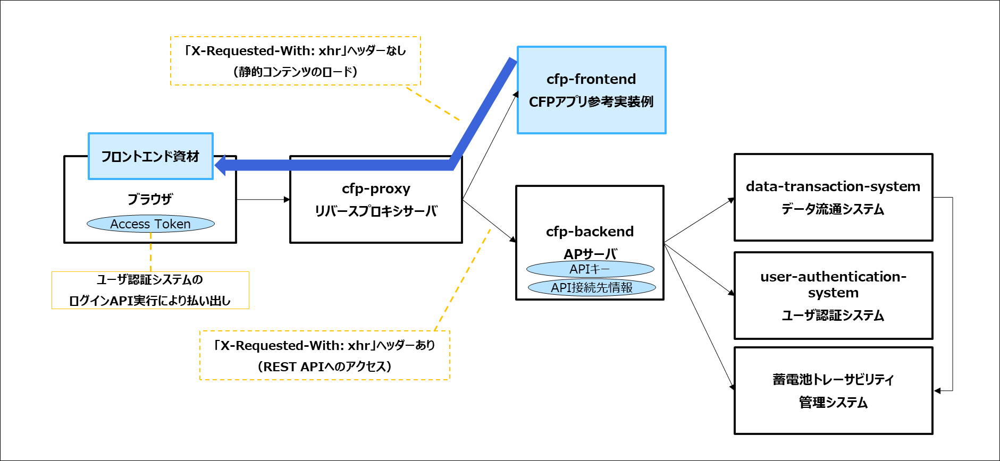

<!-- @import "[TOC]" {cmd="toc" depthFrom=1 depthTo=6 orderedList=false} -->

<!-- code_chunk_output -->

- [概要](#概要)
  - [アプリケーション構成](#アプリケーション構成)
- [前提とする環境](#前提とする環境)
  - [アプリケーション実行環境](#アプリケーション実行環境)
- [ビルド・起動手順](#ビルド起動手順)
  - [リポジトリのクローン](#リポジトリのクローン)
  - [ローカル環境での起動](#ローカル環境での起動)
    - [ソフトウェアのインストール](#ソフトウェアのインストール)
      - [Nginx](#nginx)
    - [Nginxの設定](#nginxの設定)
    - [Nginxの起動](#nginxの起動)
    - [アプリケーションの停止](#アプリケーションの停止)
- [ライセンス](#ライセンス)

<!-- /code_chunk_output -->


## 概要

当アプリケーションは、蓄電池トレーサビリティ管理システムの CFP アプリ参考実装例である。

### アプリケーション構成

当アプリケーションは、Web UI (ouranos-ecosystem-sample-application-cfp-frontend, 以下 cfp-frontend) およびリバースプロキシサーバ (ouranos-ecosystem-sample-application-cfp-proxy, 以下 cfp-proxy) APサーバ (ouranos-ecosystem-sample-application-cfp-backend, 以下 cfp-backend) の併用が前提となる。
本レポジトリでは cfp-proxy を説明対象とし、cfp-frontend と cfp-backend は別のリポジトリで提供する。



- CFPアプリ参考実装例 (cfp-frontend)
  - 蓄電池トレーサビリティ管理システムの CFP アプリ参考実装例である。
  - データ流通システム API および蓄電池トレーサビリティ管理システム API を利用してデータの参照や登録を行う。
  - ブラウザは、当アプリケーションからフロントエンド資材をロードする。
  - 当アプリケーションからこれらの API へアクセスを行う際には、`X-Requested-With: xhr` ヘッダーが付与される。
  - リバースプロキシサーバ (cfp-proxy)により `X-Requested-With: xhr` ヘッダーの有無で転送先を振り分ける。
  - API のエンドポイントと API キーの情報は、cfp-backend アプリケーションが保持するため、当アプリケーション内での設定は行わない。

- リバースプロキシサーバ (cfp-proxy): 当アプリケーション
  - ブラウザからのアクセス先となるリバースプロキシサーバである。
  - cfp-frontend アプリケーションにて API アクセス時に付与される `X-Requested-With: xhr` ヘッダーの有無に応じて、振り分け転送を行う。
    - `X-Requested-With: xhr` ヘッダーが付与されていない場合: CFP アプリ参考実装例 (cfp-frontend) へ転送する。
    - `X-Requested-With: xhr` ヘッダーが付与されている場合: AP サーバ (cfp-backend) へ転送する。

- APサーバ (cfp-backend)
  - データ流通システム API と 蓄電池トレーサビリティ管理システム API へのアクセスを制御する AP サーバである。
  - API のエンドポイントと API キーの情報を保持する。
  - ブラウザからの API リクエストを処理する。

## 前提とする環境

### アプリケーション実行環境

| ツール | バージョン |
| ------ | ---------- |
| nginx   | 1.25    |

## ビルド・起動手順

### 前提

+ git clientがインストールされていること。
+ git bashなど、POSIX準拠のシェルで作業を実施すること。
+ curlがインストールされていること。

### リポジトリのクローン

当リポジトリのクローンを行う。

```sh
# 当リポジトリのクローン
mkdir -p ~/workspaces
cd ~/workspaces
git clone https://github.com/ouranos-ecosystem-interop-data-infra/ouranos-ecosystem-sample-application-cfp-proxy.git cfp-proxy
```

### ローカル環境での起動
#### ソフトウェアのインストール
##### Nginx
下記リンク先からNginxをダウンロードし、展開する。
http://nginx.org/download/nginx-1.25.4.zip
```
# ダウンロード
mkdir -p ~/software
cd ~/software
curl -O http://nginx.org/download/nginx-1.25.4.zip

# 展開
unzip nginx-1.25.4.zip
```

#### Nginxの設定

```sh
# 設定ファイルをコピー。
cp ~/workspaces/cfp-proxy/server.conf.local ~/software/nginx-1.25.4/conf/server.conf

# 設定ファイルの読み込み設定
sed -i '/http {/a \    include server.conf;' ~/software/nginx-1.25.4/conf/nginx.conf
```

#### Nginxの起動
nginx.exeを実行する。
exeファイルを起動するため、cmdやpowershellなどで実行する。

下記でcmdの場合の例を示す。
```sh
cd %USERPROFILE%/software/nginx-1.25.4

# cmdの場合
nginx.exe

# curlでnginxの起動確認。ポート3000の cfp-frontend を起動してない場合は、502 Bad Requestが返却される。
curl http://localhost

# curlでnginxの起動確認。ポート8080の cfp-backend を起動してない場合は、502 Bad Requestが返却される。
curl -H "X-Requested-With: xhr" -H "Authorization: Bearer org1" 'http://localhost/api/v1/datatransport?dataTarget=parts&parentFlag=true&limit=100'
```

#### アプリケーションの停止
nginx.exeを実行する。
exeファイルを起動するため、cmdやpowershellなどで実行する。

下記でcmdの場合の例を示す。
```sh
cd %USERPROFILE%/software/nginx-1.25.4

nginx.exe -s quit
```

## ライセンス
- 本リポジトリはMITライセンスで提供されています。
- ソースコードおよび関連ドキュメントの著作権は株式会社NTTデータグループに帰属します。
